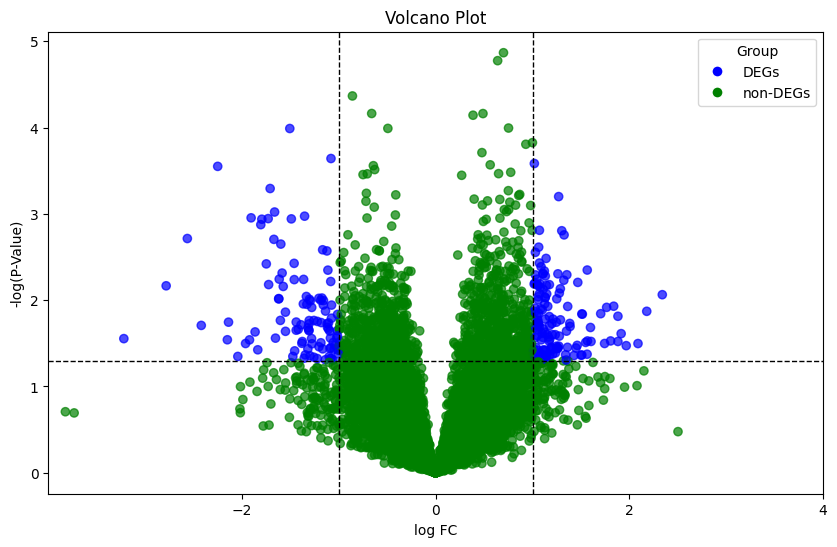
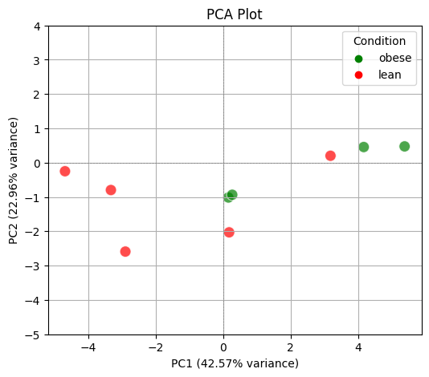

## 🧬 Gene Expression Figure Reproduction

A Python-based analysis of tuberculosis (TB) and obesity gene-expression datasets, reproducing volcano plots and PCA visualizations using clean, reproducible bioinformatics workflows.

## Project Overview
This repository contains my work for BF550 Project, where the goal was to reproduce two gene-expression figures from published research papers using Python. The project focuses on understanding data processing workflows, statistical testing, and visualization techniques used in transcriptomics.

- A volcano plot from a tuberculosis biomarker study (GSE57736), highlighting differentially expressed genes using log₂ fold change and adjusted p-values.
- A PCA plot from an obesity transcriptomics study (GSE39375), demonstrating sample clustering through dimensionality reduction.

## Methods
The analysis integrates statistical testing, dimensionality reduction, and high-quality visualization. All steps were performed in Python 3 using the following scientific libraries:

Packages used:
```pandas, numpy, matplotlib, seaborn, scikit-learn, statsmodels, scipy```

1. Data Import & Cleaning
- Loaded raw gene-expression matrices using pandas
- Reformatted column names & ensured consistent sample metadata
- Removed missing values and filtered low-variance genes
- Converted all expression values to numeric format for analysis
- Prepared condition labels (case vs. control / group categories)

2. Differential Gene Expression (DGEA)
- Split TB samples into case vs. control groups
- Calculated log₂ fold change using ```numpy```
- Computed t-test p-values with ```scipy.stats```
- Applied Benjamini–Hochberg FDR correction using ```statsmodels```
- Compiled DEG results (log₂FC, p-values, adjusted p-values, significance)

3. PCA for Dimensionality Reduction
- Standardized gene expression using ```StandardScaler```
- Performed Principal Component Analysis (PCA) using ```sklearn```
- Extracted PC1 & PC2 to capture dominant variance
- Visualized sample clustering with clean, publication-style PCA plots

4. Figure Reproduction
- Recreated all figures programmatically using matplotlib & seaborn
- Volcano plot (TB dataset): up/down-regulated genes with log₂FC vs. −log₁₀(p)
- PCA plot (obesity dataset): sample clusters along PC1 & PC2
- Exported all figures as high-resolution PNGs in the ```Results/``` folder

## Results

This figure highlights differentially expressed genes between TB-positive and TB-negative samples using log₂ fold change and adjusted p-values.

Volcano Plot Preview:
- 


This PCA visualization demonstrates sample separation based on transcriptomic profiles, helping identify clustering patterns related to obesity.

PCA Plot Preview:
- 

## How to Run This Project

If you want to reproduce the figures or explore the analysis yourself, you can run the project locally in just a few steps.
1. Clone the Repository
- git clone https://github.com/<shreejyoti>/python_gene_expression_analysis.git
- cd python_gene_expression_analysis
- Or simply download the ZIP file from GitHub and open it on your machine.

2. Install Required Python Packages
- Make sure you have Python 3 installed, then install all dependencies:
- pip install pandas numpy matplotlib seaborn scikit-learn statsmodels scipy

3. Open the Jupyter Notebook
- Navigate into the Code/ directory and launch the notebook:
- jupyter notebook gene_expression_analysis.ipynb

4. Run All Cells
- Save the final plots into the Results/ folder
- No extra configuration is needed, the workflow is fully reproducible.


